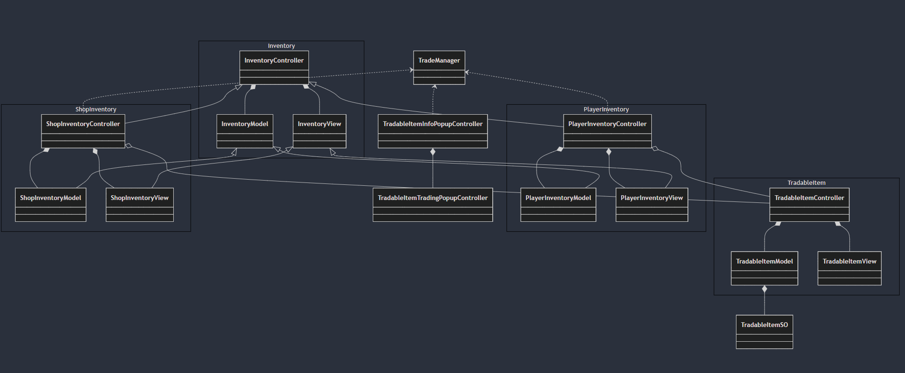

# TradingSystem
### Sumary
A scalable\game mechanic for in-game trading between player and the shop. 

### Gameplay demo
https://github.com/user-attachments/assets/be53922e-2f0a-4ed6-ba7e-e21b6830e2d9

## Architecture overview
### Block diagram

### Tradable items
Tradable items are implemented using Model-View_Controller (MVC) pattern, viz. `TradableItemModel`, `TradableItemView` and `TradableItemController`. `TradableItemController` listens to events from the `TradableItemView`. `TradableItemModel` holds the scriptable object that the item is created with.

### Tradable item scriptable object
`TradableItemSO` acts as a blueprint for all the tradable items in the game. Multiple instances of this scriptable object can be created and used supporting scalability. A list of these scriptable objects can be created and used by the scripts. More objects can be created and the game can be scaled without changing any code.

### Inventory
Inventory is also implmented as MVC. There classes act as base class for shop's and player's inventory classes.
`InventoryController` is responsible for creating and managing the tradable items. It exposes the functionalities like adding and removing items. It also relays the events received from the `TradableItemController`s that it has created to the trade manager to initiate trade.
`InventoryView` displays the items in the 2D grid.
`InventoryModel` holds a dictionary of the items that inventory has and is reponsible for adding, removing or updating this dictiionary of items. Model also maintains the information about the total weight and maximum weight of the inventory.

### Shop inventory
Implememted as MVC inheriting from Inventory MVC classes. Implements the specialization of filtering the items based on their type. Shop inventory is created by `GameManager`.  

### Player inventory
Implememted as MVC inheriting from Inventory MVC classes. Player inventory is created and managed by `Player`.

### Trade manager
`TradeManager` class is responsible for listening to buy or sell requests from the inventories and executing the trade after checking necessary preconditions like player's curreny and maximum inventory weight. This class is also responsible for managing popups utilised for trading.

### UI service
`UIService` class is a singleton that manages warning popups and the quick info tool-tip.

### `Player` and `GameplayManager`
These classes are implemented to demosntrate the mechanic. These serve the purpose of creating the inventories and adding items to them to simulate real game scenario.
