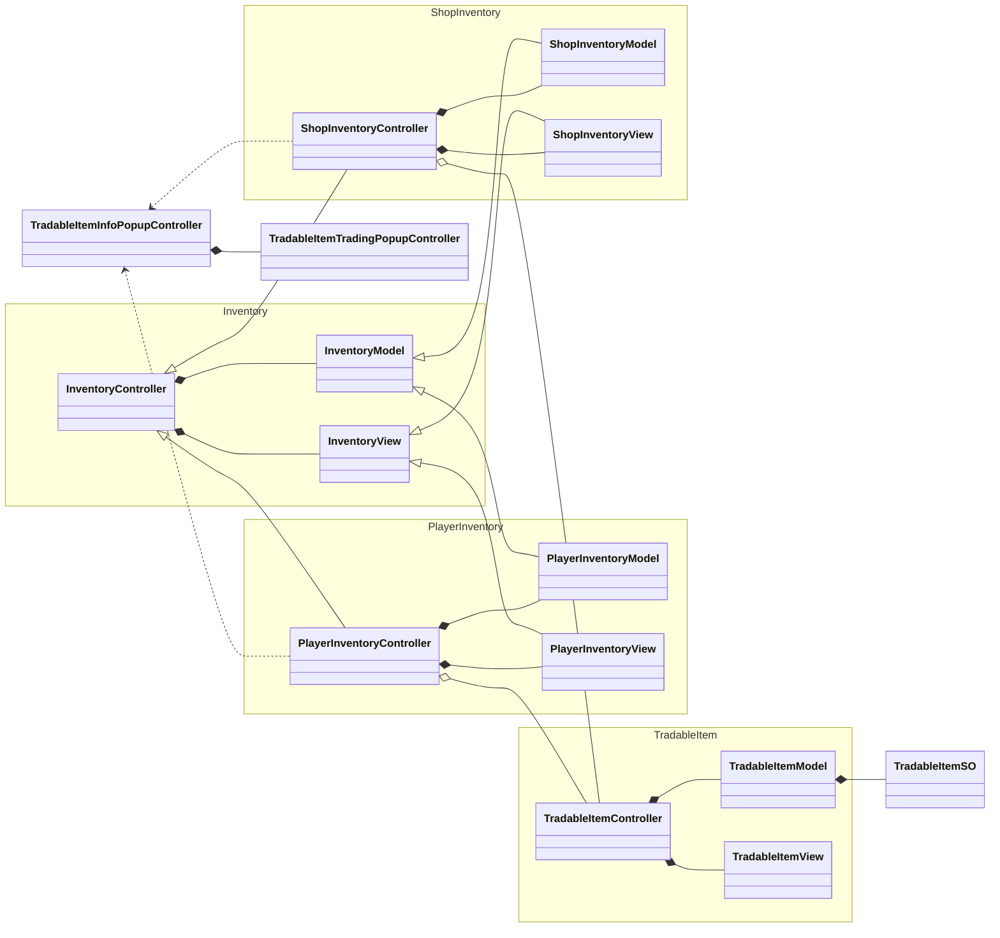

```mermaid
    classDiagram
    direction LR

    namespace Inventory {
        class InventoryController
        class InventoryModel
        class InventoryView
    }

    namespace ShopInventory {
        class ShopInventoryController
        class ShopInventoryModel
        class ShopInventoryView
    }

    namespace PlayerInventory {
        class PlayerInventoryController
        class PlayerInventoryModel
        class PlayerInventoryView
    }

    namespace TradableItem {
        class TradableItemController
        class TradableItemModel
        class TradableItemView
    }

    InventoryController <|-- PlayerInventoryController
    InventoryModel <|-- PlayerInventoryModel
    InventoryView <|-- PlayerInventoryView

    InventoryController <|-- ShopInventoryController
    InventoryModel <|-- ShopInventoryModel
    InventoryView <|-- ShopInventoryView

    InventoryController *-- InventoryModel
    InventoryController *-- InventoryView

    PlayerInventoryController *-- PlayerInventoryModel
    PlayerInventoryController *-- PlayerInventoryView

    ShopInventoryController *-- ShopInventoryModel
    ShopInventoryController *-- ShopInventoryView

    ShopInventoryController o-- TradableItemController
    PlayerInventoryController o-- TradableItemController

    TradableItemController *-- TradableItemModel
    TradableItemController *-- TradableItemView

    TradableItemInfoPopupController <.. ShopInventoryController
    TradableItemInfoPopupController <.. PlayerInventoryController

    TradableItemInfoPopupController *-- TradableItemTradingPopupController

    TradableItemModel *-- TradableItemSO
```